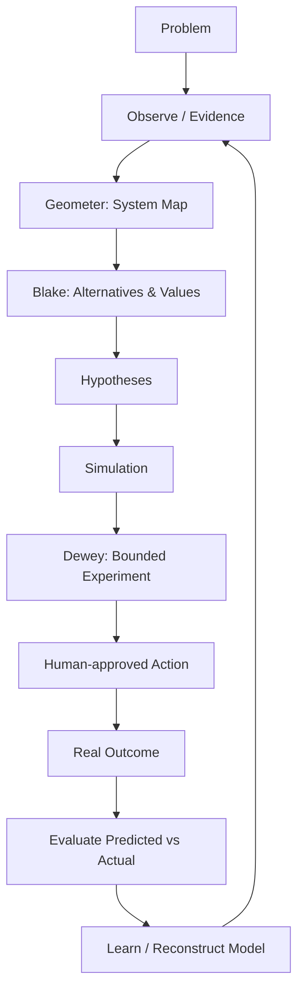
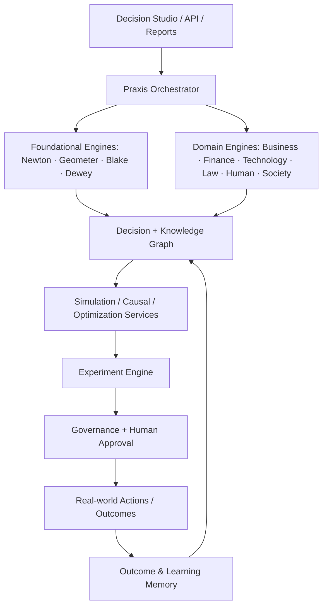

# PRAXIS OS Architecture

## System loop

## Layered architecture

## Next production components

- `EvidenceStore`: immutable provenance and effective dates.
- `DecisionGraph`: typed nodes/edges with temporal history.
- `ModelRegistry`: deterministic and probabilistic models with versioning.
- `SimulationService`: scenario, sensitivity, Monte Carlo and causal intervention APIs.
- `ExperimentService`: hypothesis, metric, guardrail, cohort, result, learning.
- `LLMGateway`: provider-neutral structured generation; no domain truth stored in prompts.
- `PolicyEngine`: permissions, data boundaries, approval thresholds and audit.
- `OutcomeEvaluator`: prediction calibration and post-decision reviews.
