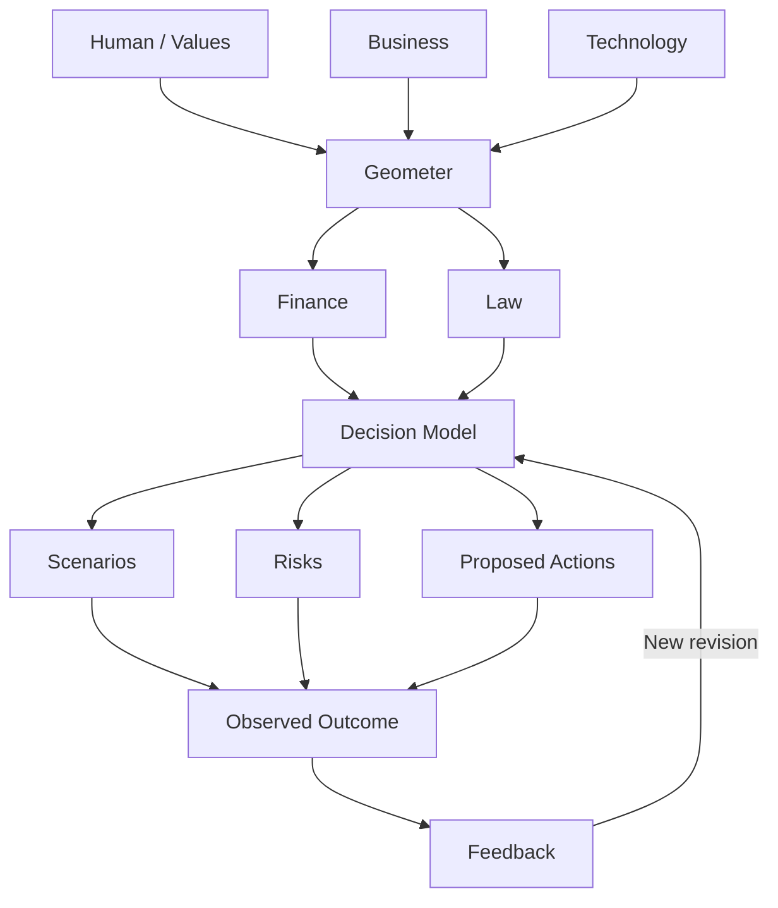

# Human-directed Geometer decision loop



Values and constraints guide Geometer's synthesis of human, business and
technology analyses. Finance and law contribute their domain assessments.
Newton, Blake and Dewey remain supporting reasoning modes. These analyses are
deterministic prompts and findings, not externally verified professional advice
or a computed causal model.

## Executable API

- `POST /v1/decision-models`: supply a `Decision` to create revision 1. Human,
  business, technology, finance and law are included automatically.
- `GET /v1/decision-models/{id}`: retrieve the latest revision.
- `GET /v1/decision-models/{id}/history`: retrieve preserved revisions.
- `POST /v1/decision-models/{id}/feedback`: attach a sourced outcome, learning
  and optional evidence to create a new revision.

Example feedback:

```json
{
  "base_version": 1,
  "outcome": {
    "summary": "Eight customers enrolled in the pilot",
    "source": "Pilot enrollment register",
    "metrics": {"customers": 8},
    "stakeholder_impacts": ["Participants requested clearer pricing"]
  },
  "learning": "Demand was below the original assumption",
  "evidence": [{
    "statement": "Pricing may be limiting demand",
    "kind": "hypothesis",
    "source": "Pilot interviews",
    "confidence": 0.4
  }]
}
```

Feedback updates the model's evidence and outcome/learning context, then reruns
the inquiry report. Original scenarios, values, constraints and historical
revisions remain intact. It does not automatically calibrate quantitative model
inputs; the existing integrated-model calibration API remains a separate step.
Stale feedback returns 409 rather than overwriting a newer revision.

Scenarios are caller-supplied; risks and proposed actions come from the existing
inquiry engines. Missing scenario inputs produce an empty scenario list, not
invented simulations. Actions are proposals; this flow executes no real-world
side effects. Reported observations are not automatically verified facts.

The flow and every revision persist in SQLite alongside the existing ledger
and graph tables. The existing `/v1/inquiry` endpoint remains available for
stateless inquiries.
